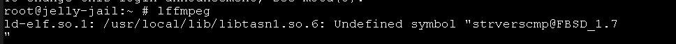

# Jellyfin playback doesn't work (2023-08-05)
Root cause appeared to be `ffmpeg` failing to run.  
A terminal in the jail when trying to run ffmpeg:

    ld-elf.so.1: /usr/local/lib/libtasn1.so.6: Undefined symbol "strverscmp@FBSD_1.7"

  

This issue only happened in `13.1-RELEASE-p9` jails. All files and packages in the jail appear to be installed correctly.

**`13.2-RELEASE-p2` jail works fine**

